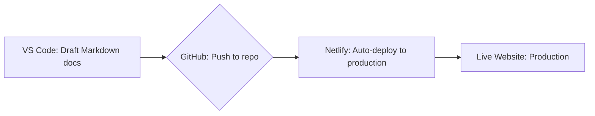

# 2024 Year in Review

In 2024, I focused on leveling up my technical writing skills, and here are four key achievements that defined my year:

<!-- more -->

## Made AI My Super Power

One of my priorities was learning how to leverage AI to be a more efficient Technical Writer. So I took an AI course for Technical Writers, offered by [Technical Writer HQ](https://technicalwriterhq.com/ai-writer-certification/). Taking this course helped me learn how to build effective prompts and significantly cut down my proofreading time. Up until then, I had been experimenting with ChatGPT for a few months but didn’t fully understand how to unlock its potential.

After completing the course, I started building custom GPTs and was mind blown at how I essentially had my own Technical Editor by my side at all times. Taking the course had a snowball effect, leading me to explore even more ways AI can enhance technical writing.

## Completed CS50

Shortly after the AI course, I took on a massive challenge: CS50, Harvard's [Introduction to Computer Science](https://pll.harvard.edu/course/cs50-introduction-computer-science). I wanted to deepen my technical knowledge so I could better understand Software Engineers and ask the right questions to build effective documentation.

I won’t go into much detail here since I already wrote a [blog post](2024-07-25-seventh-blog-post.md) about my experience, but I will say that completing the course is one of the proudest achievements of my life. It was so hard, but I did it anyway.

## Learned How to Document APIs

Another priority for 2024 was learning how to write API documentation. Ever since I learned what an API was, I’ve been fascinated by how a simple request can return useful data for applications. In the technical writing community, one resource is recommended time and time again for learning API documentation: [Tom John's course](https://idratherbewriting.com/learnapidoc/).

Tom structured the course neatly, starting with foundational API knowledge before stepping into the role of a developer. This hands-on approach was fun because I got to experiment with API calls using curl and Postman. The course also introduced me to the OpenAPI specification and interactive documentation tools. A great side effect was deepening my understanding of docs as code. While I had heard of the concept before, I didn’t truly grasp its significance until now.

One of the course activities challenges you to contribute documentation to an open-source API project. Finding the right project was tough because some seemed intimidating while many already had Technical Writers assigned. Eventually, I found a small project with a couple of endpoints for fetching publicly available data about The Ohio State University. What excited me most was that the project involved migrating from the standard Swagger UI to Docusaurus for a more user-friendly and customizable documentation experience. Since one of my writing portfolio sites also uses Docusaurus, I was eager to explore new plugins and build a more user-friendly site.

I ended up [forking](https://github.com/genesis-writing/dev-api) the repo and creating a site with future versioning in mind as the endpoints evolved. Although the repository was eventually archived by the owner, I’m proud of what I accomplished. You can check out my [pull request](https://github.com/devosu/dev-api/pull/4) if you’re curious.

Also, huge thanks to Tom for this invaluable course!

## Embraced Docs as Code and Static Site Generators

Before taking Tom’s API documentation course, I had never worked with static site generators. Learning about them was a game-changer. The idea that I could write lightweight Markdown files and render them beautifully on a static site blew my mind.

At the time, I was also considering migrating my portfolio off WordPress (the editor was cumbersome). That’s when it clicked. Why not use a static site generator and fully embrace a docs as code workflow? With Git for version control, I could manage my content more efficiently and get comfortable using the terminal.

I experimented with both Docusaurus and MkDocs, two fantastic open-source site generators. Getting a site running in under five minutes was shockingly easy. Long story short, I ended up with two sites, just [for fun](2024-07-07-fourth-blog-post.md).

My current docs as code workflow is basic, but perfect for my needs:

1. Draft Markdown docs in VS Code.
2. Push them to a GitHub repo.
3. Auto-deploy to production with Netlify.

Along the way, I picked up other nuggets of learning. [Mermaid diagrams](2024-07-05-third-blog-post.md) are created from words? WOW. [YAML](2024-07-08-fifth-blog-post.md) indentation issues? One wrong space, and suddenly, a broken deployment sends me down a troubleshooting rabbit hole.

## Building on 2024 in 2025

I can't wait to build on everything I learned last year, diving deeper into new AI applications for technical writing and API docs. Here's to another year of growth ⭐️.