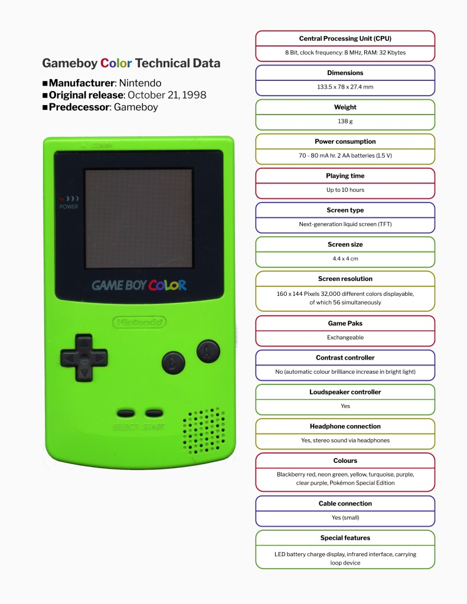

# Gameboy Colour Technical Data Sheet

## **Overview**

This document features a technical data sheet for the Gameboy Color, a handheld video game console manufactured by Nintendo. I’ve spent countless hours playing various games on it and decided to pay homage.

I referenced the specifications from Nintendo’s UK website, specifically their <u>[technical data](https://www.nintendo.com/en-gb/Support/Game-Boy-Pocket-Color/Product-information/Technical-data/Technical-data-619585.html)</u> page.

## **Technical Data Sheet**

