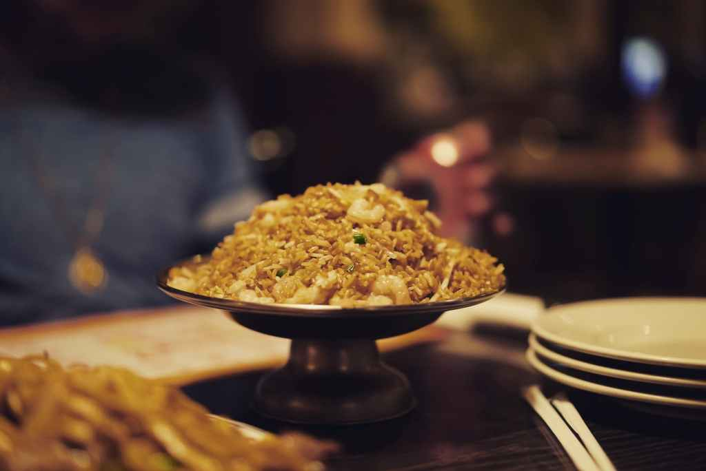

# How to Cook Shrimp Fried Rice

## **Overview**

This recipe helps you cook two portions of shrimp fried rice. It’s referenced
from an Instagram video titled <u>“[How to Make Shrimp Fried Rice](https://www.instagram.com/p/CBT2d8-gDBn/?utm_source=ig_web_copy_link)”</u>
by @chefchrischo.

## **Requirements**

### Cooking Equipment

  * Stove
  * Large frying pan
  * Ladle
  * Bowls: two will be used for serving, one to hold food items.
  * Measuring spoons

### Ingredients

  * Cold rice: two cups (best if cooked the night before to ensure it fries consistently)
  * Chopped carrots: 50 grams
  * Chopped onions: 50 grams
  * Shrimp: fresh or thawed from frozen, 150 grams
  * Eggs: two
  * Sesame oil
  * Soy sauce
  * Minced garlic
  * Chopped scallions
  * Salt
  * Pepper
  * Butter

## **Cooking Process**

**Duration**: Approximately 15 minutes

  1. Add a splash of sesame oil to a pan over medium heat.
  2. Once the pan is hot, break two eggs into the pan and scramble them.
  3. Put the cooked eggs in a bowl to the side.
  4. Add a splash of oil to the pan along with 1/2 tablespoon of garlic and three tablespoons of scallions.
  5. Add shrimp.
  6. Once shrimp is cooked about 80%, add onions and carrots.
  7. Season with salt and pepper to taste.
  8. Add one tablespoon of butter to the pan.
  9. Add rice to the pan.
  10. Add one tablespoon of soy sauce and 1/2 tablespoon of sesame oil to the rice.
  11. Break up rice.
  12. Add cooked eggs back to the pan.
  13. Mix rice to ensure even distribution of ingredients.
  14. Serve!

Photo by Ricardo Esquivel on
<u>[Pexels.com](https://www.pexels.com/photo/food-on-bowl-1630495/)</u>

