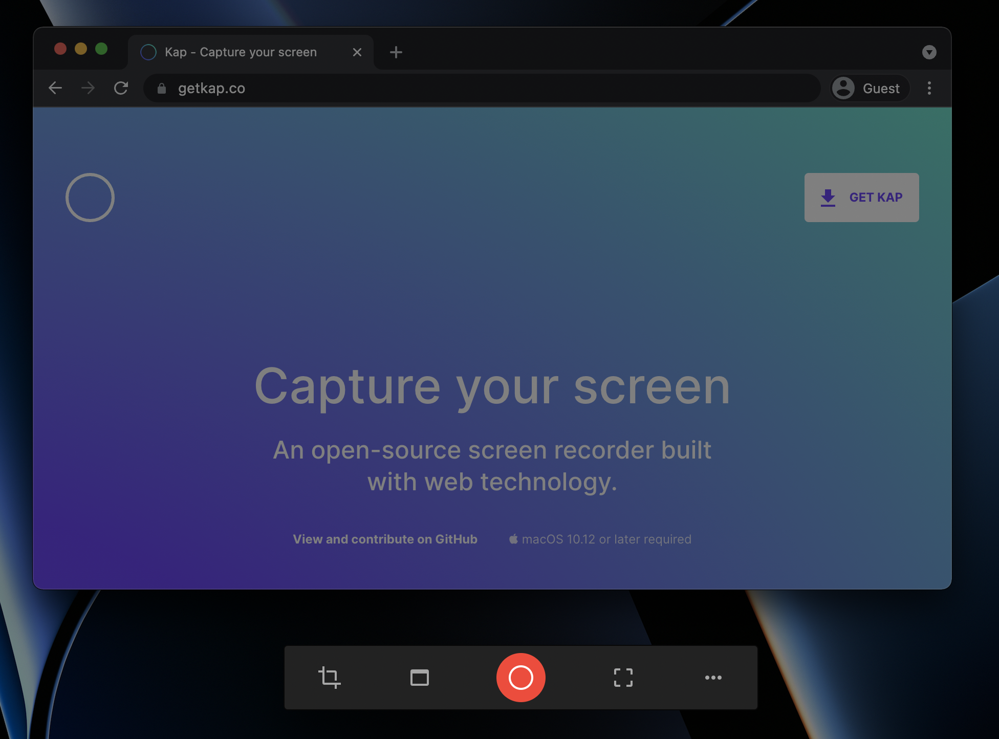
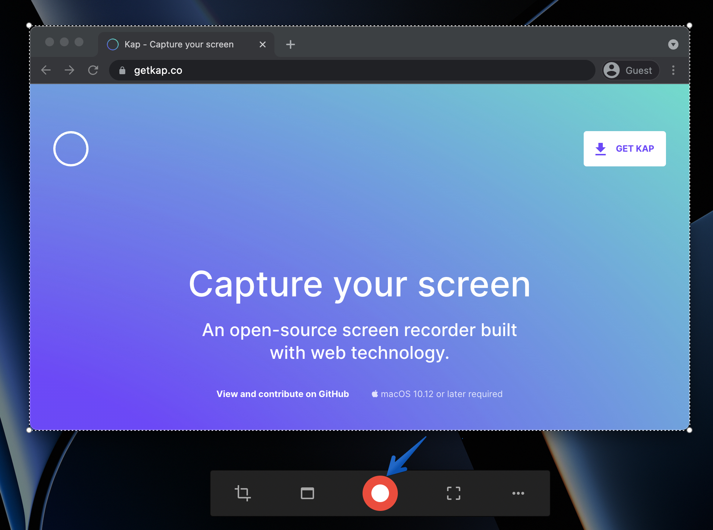
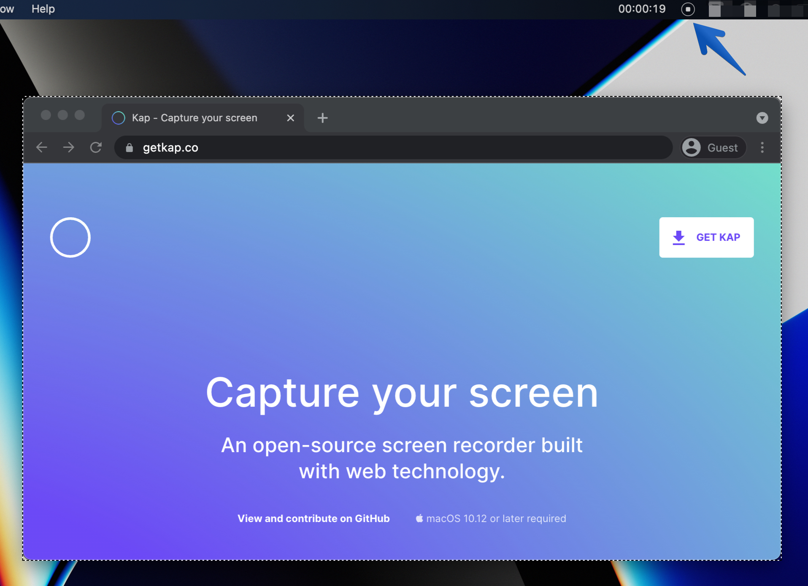
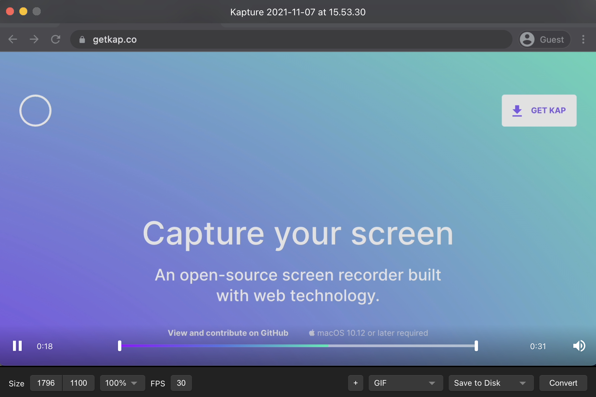

#  How to Complete a Recording

## **Purpose**

This guide helps you understand how to start and end a screen recording session.

## **Five-step Process**

### Step 1

Open the Kap application. The screen will darken, and the toolbar will display.

### Step 2

Define the recording area in one of three ways. For more details on these methods, refer to the [toolbar guide](Tool-Bar_393330.md).

  * Cropped capture
  * Application window capture
  * Full-screen capture

### Step 3

Click the record button to begin recording.

### Step 4

Click the stop button in the menu bar to end the session.

### Step 5

After the recording ends, an editor window will display. For more details on the editor’s options, refer to the [editor guide](Editor_262804.md).

