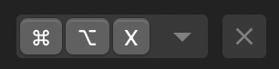
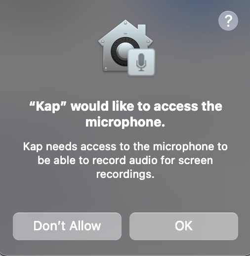

# Preferences and Plugins

## **Purpose**

This guide highlights the available options within the app's preferences and shows you how to enable plugins to enhance your user experience. The keyboard shortcut for preferences or plugins is ⌘ , (command + key).

## **Preferences**

### General

This general section contains various settings for customizing your recording experience. Some settings allow you to choose options from dropdown menus, such as selecting the destination folder for recordings, while others use toggle buttons for features like showing or hiding the cursor.

  1. **Show cursor**: Hide or display the mouse cursor within your recordings.
  2. **Highlight clicks**: If "Show cursor" is enabled, highlight clicks made during a recording by surrounding the cursor with a circle.

  1. **Keyboard shortcuts**: Set up keyboard shortcuts to access Kap's toolbar instantly. Choose from predetermined options or create one from scratch (e.g., ⌘ ⌥ X).

  1. **Loop exports**: Infinitely loop export files.
  2. **Audio recording**: Record audio from an input device. Enable this to grant Kap access to the microphone and select an input device like your Mac's microphone or a headset.

  1. **Capture frame rate**: Change the FPS with this option; increased FPS impacts performance and file size. Options: 30 FPS or 60 FPS.
  2. **Allow analytics**: Send anonymous usage stats to the developer to help improve Kap.
  3. **Start automatically**: Launch Kap upon the system's startup.
  4. **Save to**: Choose the destination folder for recording exports.
  5.  **Lossy GIF compression**: Enable this to ensure a smaller file size, with minor quality degradation.

### Plugins

The plugins section contains extensions that add new functions to Kap. Some are straightforward; others require additional configuration. Each plugin allows you to open its config file or view it on GitHub.

### Discover

This section lists available plugins you can enable with a toggle button.

  1. **Azure**: Upload recordings to Azure (Blob) Storage. Requires a storage account name and key.
  2. **Camera**: Show a camera while recording. Configure a device like a system webcam.
  3. **Cloudinary**: Share recordings on Cloudinary. Requires a cloud name, API key, and API secret.
  4. **Do-not-disturb**: Silence notifications while recording.
  5. **Fanfou**: Share GIF exports on Fanfou. Requires a consumer key, consumer secret, OAuth token, and OAuth token secret.
  6. **Gfycat**: Share GIF exports on gfycat. Requires an API key and API secret.
  7. **Gifski**: Create high-quality GIF exports using Gifski.
  8. **Giphy**: Share GIF exports on GIPHY. Requires an API key.
  9. **Hide-clock**: Hide the menu bar clock or Dato app while recording.
  10. **Hide-desktop-icons**: Hide your desktop icons while recording. Configure the wallpaper that will display during the recording.
  11. **Imgur**: Share GIF exports on Imgur. Requires a client ID.
  12. **kDrive**: Upload a screencast to an Infomaniak drive. Requires a kDrive path.
  13. **Key-cast**: Show keys you press while recording in the final export. Configure the UI size, duration, position, and key combinations.
  14. **Nextcloud**: Upload a screencast to a Nextcloud Instance. Requires a Nextcloud URL and path.
  15. **Now**: Share exports on Now. Requires a Now token.
  16. **Playback-speed**: Speed up or slow down recordings. Configure the slow-down percentage.
  17. **Progress bar**: Add a progress bar to screen recordings. Configure the bar's height, location, and color.
  18. **Recording-name**: Create meaningful names for recordings. Configure a template for each file name.
  19. **Recording-time**: Display the time elapsed while recording. Hide the hour digits until required.
  20. **Reverse**: Reverse recordings.
  21. **S3**: Share exports on Amazon S3. Requires a region, access key, secret access key, S3 path, and base URL.
  22. **Soundflower**: Record the system audio using Soundflower. Configure the system audio, combine input/output devices, and include system sounds like notifications within recordings.
  23. **Streamable**: Share exports on Streamable.
  24. **Transfer**: Share exports on Transfer.
  25. **Vercel**: Share exports on Vercel.

### Installed

Whenever you enable a plugin, it will be listed in this section. Use the pencil icon to configure each plugin or disable it with the toggle.

