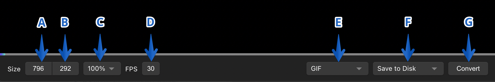
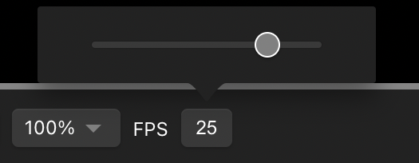
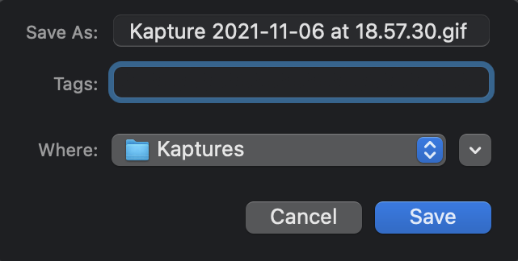
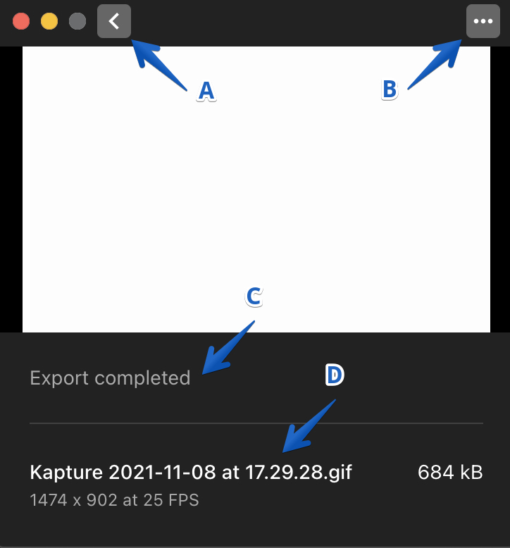

# Editor

## **Purpose**

This guide highlights the available options in the Kap editor. The default options are described below; other alternatives may appear when you enable specific plugins. We’ll also review the export menu.

## **Introduction to Editor Options**

  * **A**: Size width
  * **B**: Size height
  * **C**: Size percentage
  * **D**: Frames per second
  * **E**: File format selector
  * **F**: Export location selector
  * **G**: Conversion

## Options Overview

### Size Width and Height

Customize the size of the exported recording by inputting a numerical value.

### Size Percentage

Customize the size by a percentage value. Available options are:

  * Original (100%)
  * 75%
  * 50%
  * 33%
  * 25%
  * 20%
  * 10%

### Frames per second

Control the exported recording’s frames per second. The lowest value is five, and the highest is 30. Input a number or slide the selector to adjust.

### File Format Selector

Select the format for the exported file. Available options are:

  * GIF
  * MP4 (H264)
  * WebM
  * MP4 (H265)
  * MP4 (AV1)
  * APNG

### Export Location Selector

Select the destination for the exported file. Options may change depending on
enabled plugins. Default options are:

  * **Save to disk**: Save the file to a folder on the system.
  * **Copy to clipboard**: Copy the file to the clipboard to paste in the desired location.
  * **Open with**: List available system applications to open the file.
  * **Get plugins**: Directs to the plugin options within the app’s preferences.

### Conversion

Save recordings as exported files after setting all desired parameters. Customize each file’s name, tags, and destination.

## **Export Menu**

  * **A** – **Back button**: Takes you back to the editor.
  * **B** – **Ellipsis**: Contains options to copy the exported file to the clipboard or view it in the Finder.
  * **C** – **Export status**: Displays the status of the exported file with a timestamp for completion.
  * **D** –**Export history**: Displays completed exports within the current session

