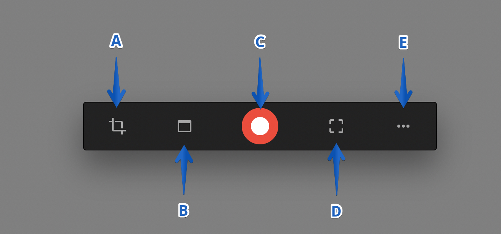
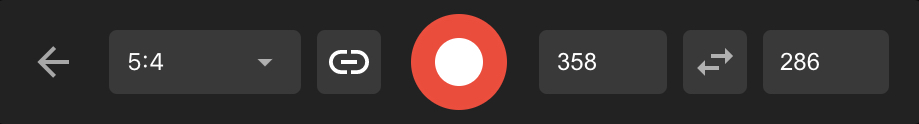
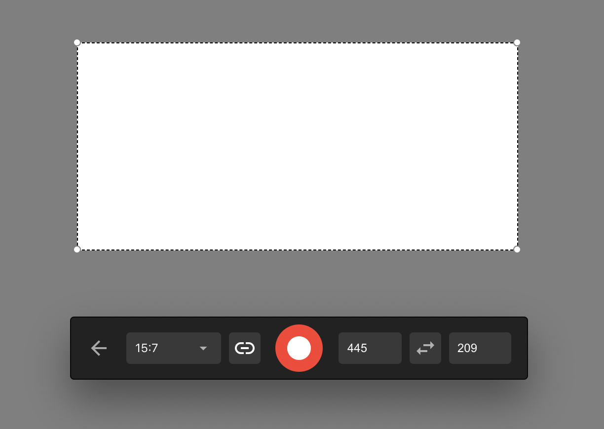
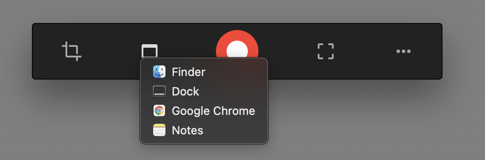

# Tool Bar

## **Purpose**

This guide highlights the available options in the Kap toolbar.

## **Introduction to Toolbar Options**

  * **A**: Cropped capture
  * **B**: Application window capture
  * **C**: Record
  * **D**: Full-screen capture
  * **E**: Other

## **Options Overview**

### Cropped Capture

Crop to control the aspect of the recording area. Choose from available ratio options or customize them to fit your needs.

#### Aspect Ratio Options

Choose from six ratios:

  * 16:9
  * 5:4
  * 5:3
  * 4:3
  * 3:2
  * 1:1

#### Custom Ratio

Customize the ratio by manually adjusting the cropped area with your cursor or inputting values for the width and height.

### Application Window Capture

Capture an area according to the applications you currently have open. Choose to record a specific window, such as the Finder, Dock, Google Chrome, or Notes.

### Record

Once satisfied with the recording area, start recording by selecting this option.

### Full Screen Capture

Capture your entire screen with this option.

### Other

Find miscellaneous items under this option:

  1. **About Kap**: Displays the app version installed on your Mac.
  2. **Preferences**: Modify general settings or enable/disable plugins. Refer to the <u>[preferences and plugins guide](preferences-and-plugins.md)</u> for more details. The keyboard shortcut is ++cmd+comma++ (command + comma).
  3. **Plugins**: Enable or disable configurable plugins. Refer to the <u>[preferences and plugins guide](preferences-and-plugins.md)</u> for more information. The keyboard shortcut is ++cmd+comma++ (command + comma).
  4. **Open Video**: Open a video file. The keyboard shortcut is ++cmd+o++ (command + O).
  5. **Export History**: List the history of the exported recordings within the current session.
  6. **Send Feedback**: Open an issue on GitHub. Review existing issues to avoid duplicates. You can also check the <u>[developer's issues list.](https://github.com/wulkano/Kap/issues)</u>
  7. **Quit Kap**: Close the application. The keyboard shortcut is ++cmd+q++ (command + Q).