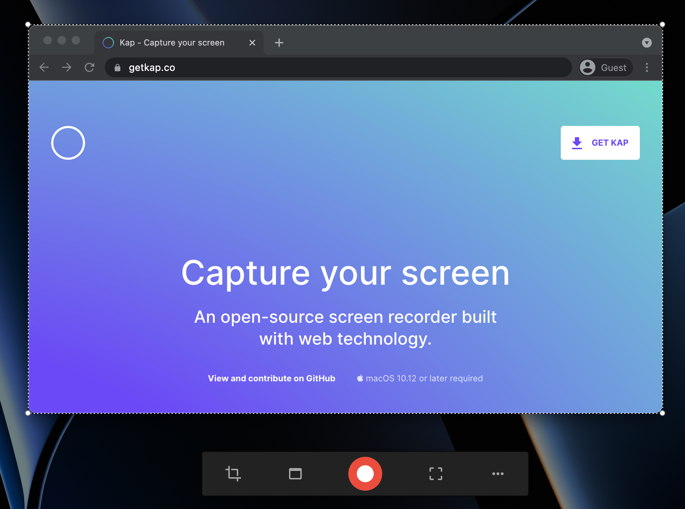
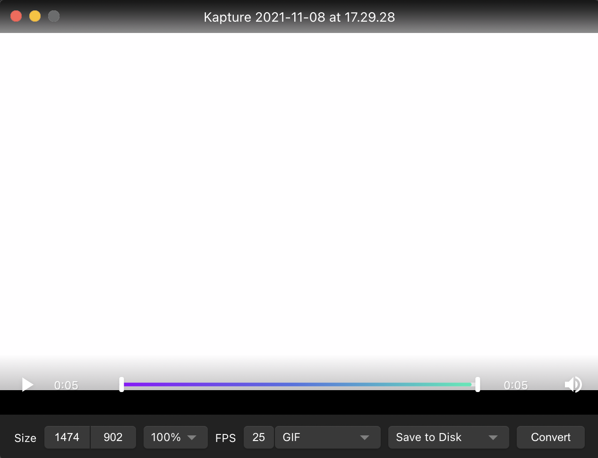

# Quick Start Guide

## **Purpose**

This guide helps you quickly get up and running with the Kap app. For more details, refer to the <u>[comprehensive user guide](./comprehensive_user_guide/tool-bar.md)</u>.

## **Requirements**

Before you begin, ensure you have:

  1. Installed the application (refer to the <u>[installation guide](./setting_up_kap/installation-guide.md)</u>).
  2. Allowed the Kap application to record your screen (refer to the <u>[screen recording access guide](./setting_up_kap/screen-recording-permission-guide.md)</u>).

!!! tip

    Open Kap from your Applications folder. If you use this app frequently, right- click the dock icon, choose options, and select "Keep in Dock".

## **How to Complete a Recording in Six Easy Steps**

### Step 1

Open the Kap application. The screen will darken, and the toolbar will display.

### Step 2

Define the recording area in one of three ways:

  1. Cropped capture
  2. Application window capture
  3. Full-screen capture

### Step 3

Click the record button to start recording.

### Step 4

Click the stop button in the menu bar to end the session.

### Step 5

After the recording ends, an editor window will display.

### Step 6

Set size parameters, frames per second, file format, and export location. Click **" Convert"** to save the recording. You can also customize the file's name, tags, and destination.

## **Preferences and Plugins**

Modify Kap's preferences and enable plugins to customize the app to your needs. The keyboard shortcut to the app's preferences is ++cmd+comma++ (command + comma). For more information, refer to the <u>[preferences and plugins guide](./comprehensive_user_guide/preferences-and-plugins.md)</u>.