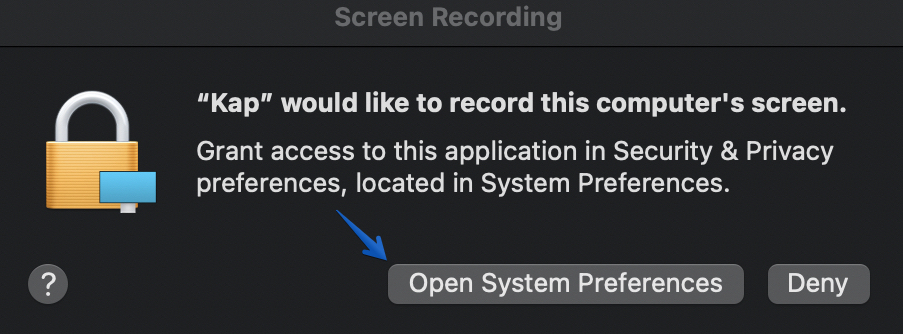
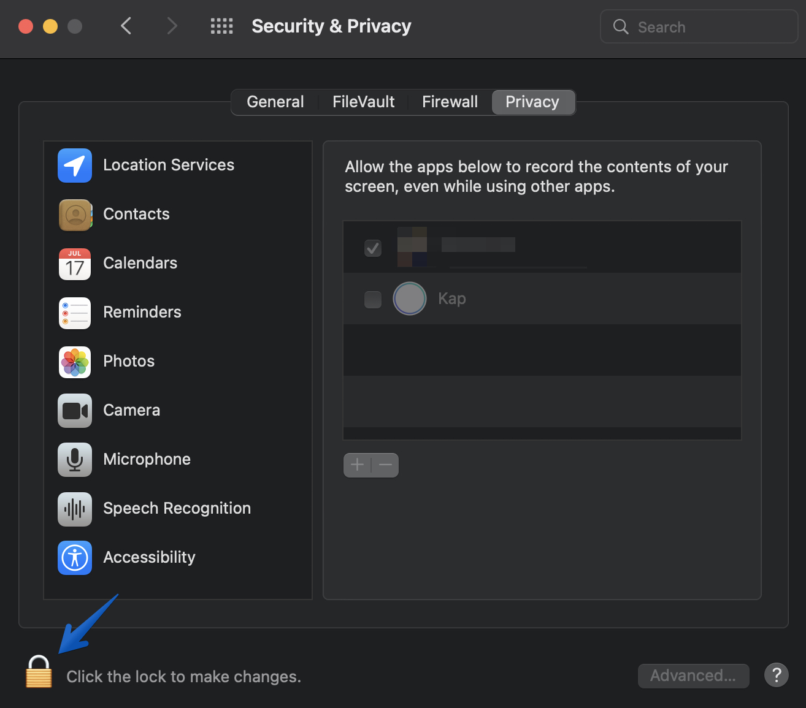
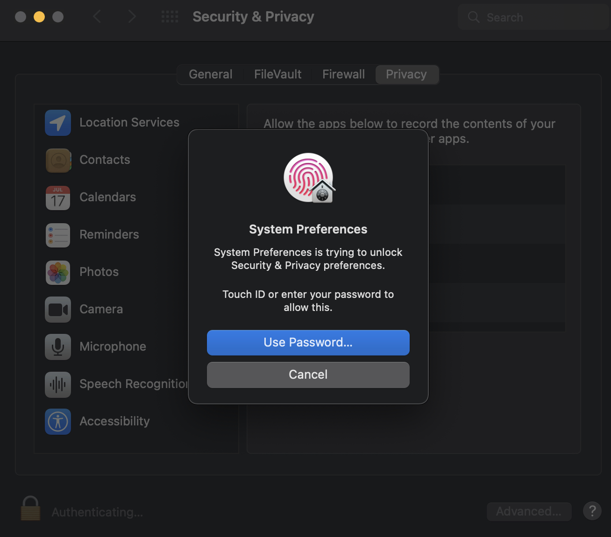
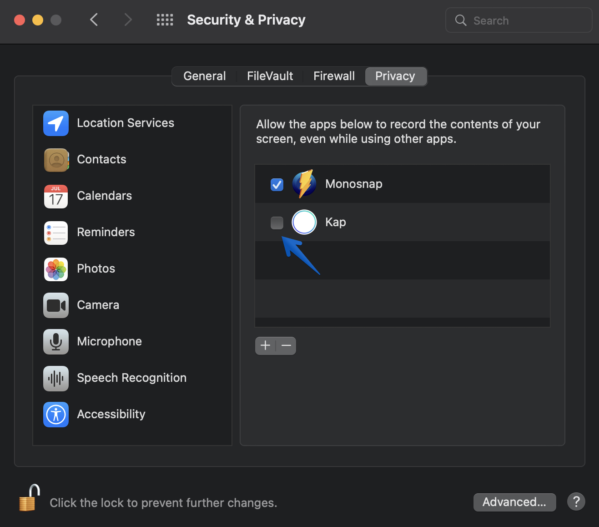
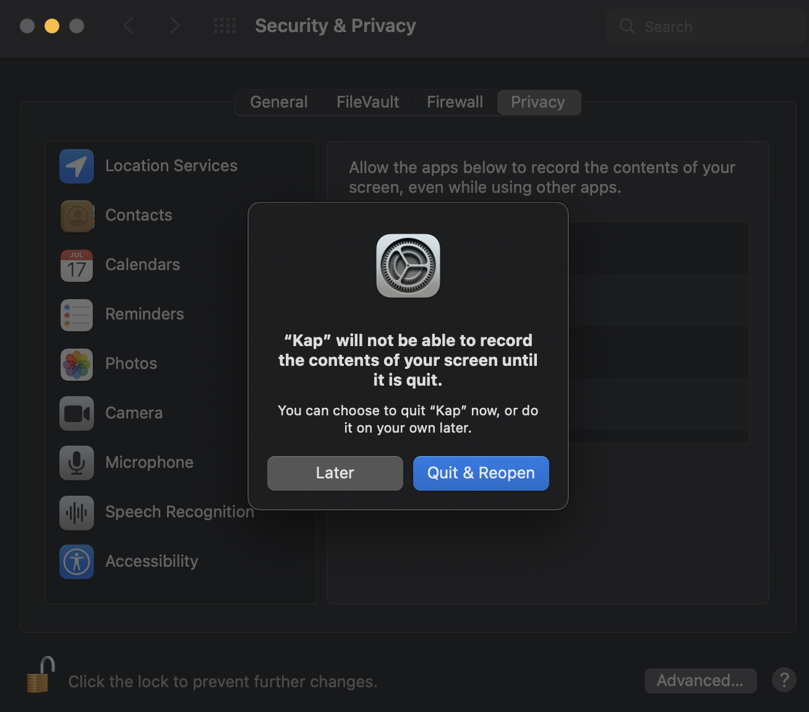

# Screen Recording Permission Guide

## **Purpose**

This guide helps you grant the required access on your Mac to ensure Kap can record your screen.

## **Four-step Process**

### Step 1

When you first open Kap, a pop-up window requests access to record your screen. Click **“Open System Preferences”**.

### Step 2

Notice that the Kap checkbox is not selected. Click the lock icon to update the list of allowed applications.

### Step 3

Use your touch ID or Mac login password to add Kap to the Privacy list.

### Step 4

Check the box next to Kap.

### Step 5

A prompt informs you to close and re-launch Kap to begin using it or opt to complete this later.

!!! tip

    To record audio, grant Kap access to your microphone if you intend to narrate video.

