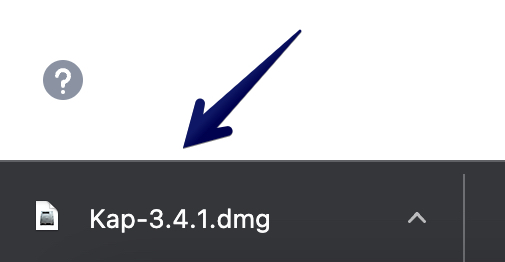
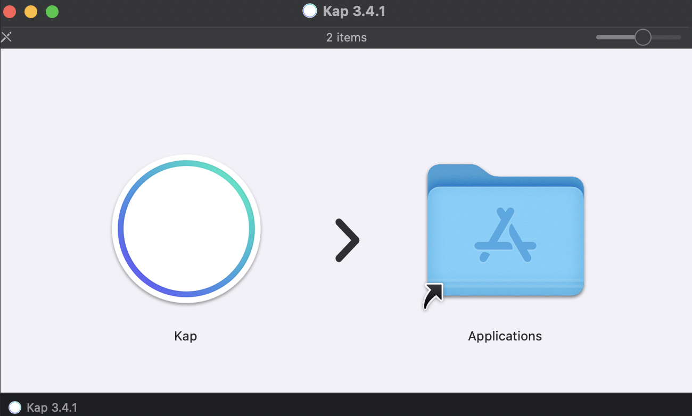

# Installation Guide

## **Purpose**

This guide helps you install the Kap application on your Mac.

## **Three-step Process**

### Step 1

Visit the <u>[Kap homepage](https://getkap.co/)</u> and click **“GET KAP”**.

### Step 2

Double-click the .dmg file in your browser downloads.

### Step 3

Move the Kap application to your Applications folder.

!!! tip

    Delete the Kap .dmg file from your browser downloads.