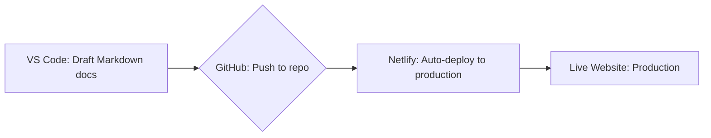

# My Portfolio's Tech Stack 

Hi there! Curious about the tech behind this portfolio? Let me give you a quick peek at the tools I use to build and maintain it, and why I'm excited about using them as a Technical Writer embracing docs as code.

## Tools

This site is built using a few key tools I enjoy working with:

* **MkDocs:** This static site generator is specifically designed for documentation websites, and it's been a game changer for me. Switching from WordPress has been a breath of fresh air. The site is lightning fast, and content management is incredibly smooth. Now, all I need to focus on is crafting my content in Markdown, and MkDocs renders it beautifully into HTML. It's like magic! 🎩🪄🐇
*  **Material for MkDocs:** This theme elevates MkDocs sites visually and functionally. Thanks to its extensive customization options, easily managed through the site's YAML file, I can easily tailor my site's appearance and functionality through plugins. I leverage plugins for essential functionality such as website analytics (using Google Analytics) and user privacy compliance (with a cookie consent form).
* **VS Code and Markdown:** My go-to for writing. Markdown's clean and simple syntax keeps my focus squarely on the content itself, and VS Code is just the perfect environment for it. Extensions like [Markdown Preview Enhanced](https://marketplace.visualstudio.com/items?itemName=shd101wyy.markdown-preview-enhanced) are brilliant. Live previews are helpful for getting things just right, and the built-in Mermaid support is a fantastic bonus for adding diagrams.
* **Git Version Control:** Essential for any docs as code workflow, Git is my safety net, tracking every single change I make to my content. Stored securely in a [GitHub repo](https://github.com/genesis-writing/gen-tech-writing-portfolio-and-blog), it keeps everything super organized and easily accessible.
* **Netlify:** Connected to GitHub, Netlify automates all website updates. Pushing content to GitHub triggers automatic updates to the live site, a totally hands-off and efficient deployment process.

## My Simple Docs as Code Workflow

Here's my straightforward but effective docs as code workflow, leveraging the tools described above:

1. **Markdown Content Creation in VS Code:** This text-based approach, using VS Code's robust Markdown support and extensions, keeps my focus squarely on content and structure from the outset, avoiding the distractions of clunky editors.
2.  **Git for Tracking Every Change:** Git is the backbone, providing a full history of my content and easy rollback options (for those moments when I am human). Version control in both local and remote (GitHub) repos keeps everything safe, secure, and accessible from anywhere.
3.  **Netlify for Automatic Deployment:** This automated CI/CD approach handles deployment completely. Pushing updates to GitHub triggers Netlify to rebuild and push the site live in minutes.

This tech stack and workflow are my way of putting docs as code principles into action, allowing me to create high quality, efficient, and maintainable documentation. It makes the whole process a lot more fun!

