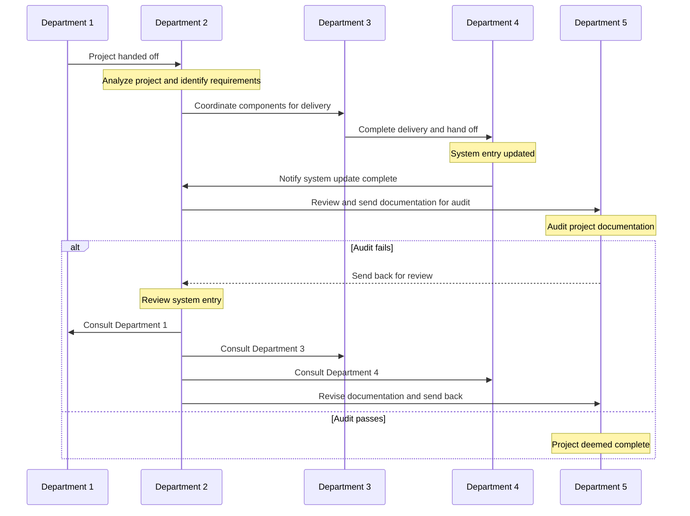
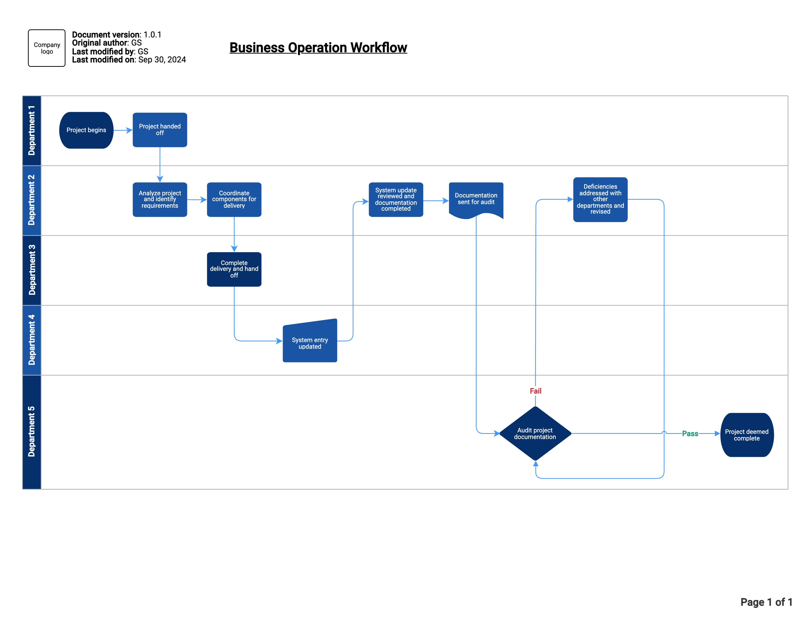

# Business Operation Process

## **Overview**

This document demonstrates the project delivery process from start to finish. It highlights each department’s responsibilities and how they fit into the workflow.

## **Departmental Responsibilities**

### Department 1
- Initiates the project.

### Department 2
- Analyzes requirements to deliver the project.
- Coordinates project components.
- Completes documentation once the software system is updated.
- If the audit has failed, reviews the system entry and consults with other departments to trace deficiencies.
- Revises documentation if the audit has failed.

### Department 3
- Completes delivery of project components.
- Hands off the project for system input.

### Department 4
- Updates software system, indicating project components are complete.

### Department 5
- Completes project documentation audit.
- Identifies deficiencies if the audit fails and sends the documentation to the responsible department for review.
- Deems the entire project complete once the audit passes.
  
## **Operational Steps**

  1. Department 1 builds the project and hands it off to Department 2.
  2. Department 2 analyzes the project, identifies requirements, and coordinates project components for Department 3.
  3. Department 3 completes the delivery as instructed by Department 2 and hands off the project to Department 4.
  4. Department 4 updates the software system to indicate project components are complete and notifies Department 2.
  5. Department 2 reviews the system entry, completes the project’s documentation, and sends it to Department 5 for an audit.
  6. Department 5 audits the project documentation for accuracy. If the audit fails, they send it back to Department 2 for review.
  7. If deficiencies are found, Department 2 reviews the system entry and consults with Departments 1, 3, and 4. Department 2 then revises the documentation and sends it back to Department 5.
  8. If the audit passes, Department 5 deems the project complete.

!!! note

    If the audit fails twice, all five department leaders meet to
    identify procedural improvements.

## **Workflow Summary**

### Mermaid Diagram

I created this sequence diagram with Mermaid.

### Swimlane Diagram

I created this swimlane diagram with draw.io.

