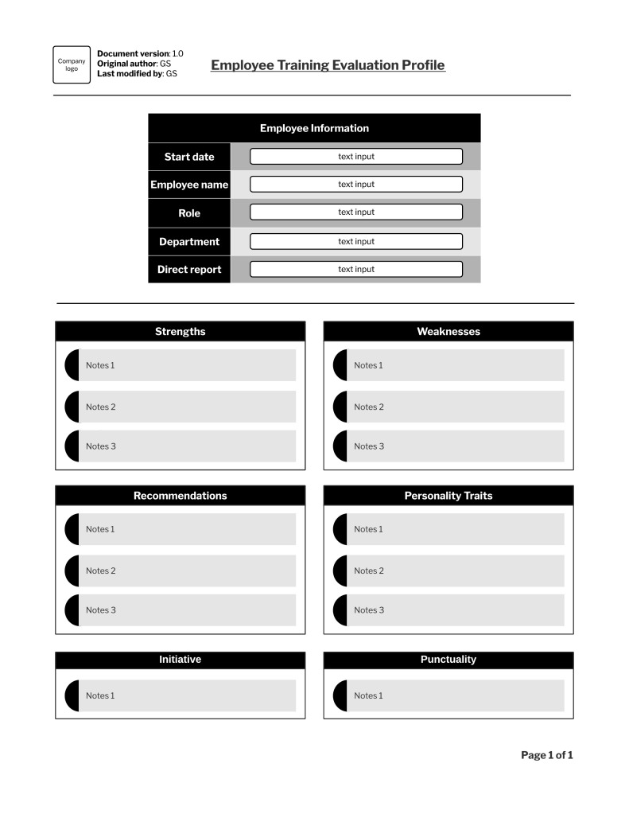

# Employee Training Evaluation Profile

## **Overview**

This document features an employee training evaluation profile used by trainers after training is complete. It showcases observations made during sessions, providing qualitative data to detect patterns of efficacy or deficiency in a training plan.

For an example of a training plan, visit the [Training Plan](training-plan.md) page.

## **Evaluation Profile**

## **Header**

  * **Company logo**: For branding purposes.
  * **Document version**: Current version for document control.
  * **Original author**: Initials of the document’s creator.
  * **Last modified by**: Initials of the latest editor.
  * **Title**: Indicates it is an employee training evaluation profile.

## **Evaluation Panels**

Each panel corresponds to an observable trait and allows text input from a trainer.

  * **Strengths**: Identify three areas the employee excels in (e.g., quick data entry).
  * **Weaknesses**: Identify three areas for improvement (e.g., slow data entry).
  * **Recommendations**: Input three follow-up steps to ensure the employee’s success post-training.
  * **Personality traits**: Reflect on three of the employee’s characteristics (e.g., open-mindedness, curiosity, confidence).
  * **Initiative**: Expand on the employee’s independence (e.g., was hand-holding required?).
  * **Punctuality**: Gauge if the employee showed etiquette by being on time.