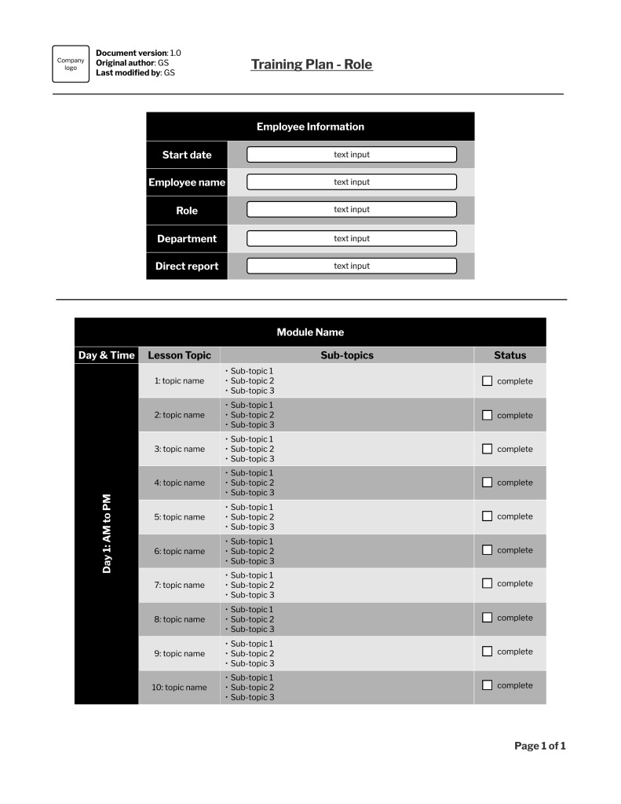

# Training Plan

## **Overview**

This document features an employee training plan template. Trainers can use this for new hires or existing team members. The plan follows a three-part structure: header, employee information, and module table.

For the post-training stage, refer to the <u>[Employee Training Evaluation Profile](employee-training-evaluation-profile.md)</u> page.

## **Plan**

## **Header**

The header includes:

  * **Company logo**: For branding purposes.
  * **Document version**: Current version for document control.
  * **Original author**: Initials of the document’s creator.
  * **Last modified by**: Initials of the latest editor.
  * **Title**: Indicates it is a training plan and the specific role it is for.

## **Employee Information**

This section allows text input into five fields related to the employee:

  1. **Start date**: Date training started.
  2. **Employee name**: First and last name of the employee (include middle name or preferred name if needed).
  3. **Role**: Employee’s job title.
  4. **Department**: Employee’s organization group.
  5. **Direct report**: Person responsible for managing the employee’s workload and performance (e.g., director, manager, supervisor).

## **Module Table**

This table outlines what the employee can expect during training sessions. You can scale this portion if more than one day of training is required.

Table Elements:

  * **Module name**: Name of the collective set of lessons (e.g., “Client Relationship Management”).
  * **Day & time**: Day and time of coverage (e.g., day 1, 9 AM to 3 PM).
  * **Lesson topic**: Individual aspects of the module (e.g., high-level overview, data entry).
  * **Sub-topics**: Building blocks for each lesson (e.g., how to log in, how supporting teams use the system).
  * **Status**: Checkbox to indicate if the employee has completed the lesson.
